# VENTRA — Autonomous UAV for GPS-Denied Indoor Exploration and Shaft Inspection

> A LiDAR-anchored quadrotor that localizes, maps and explores where satellite navigation cannot reach.

<p align="center">
  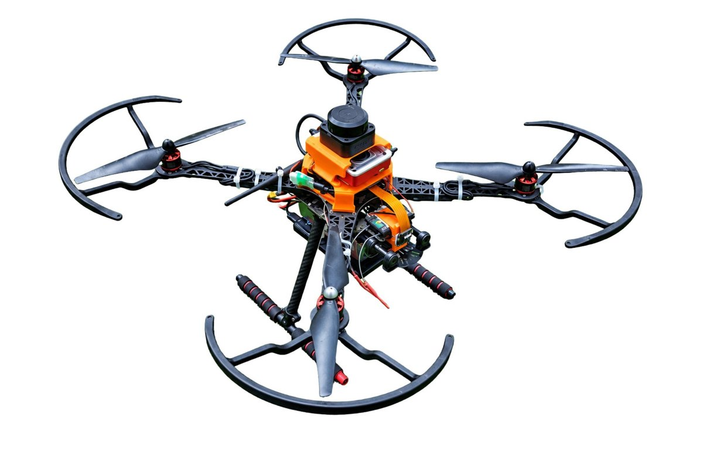
  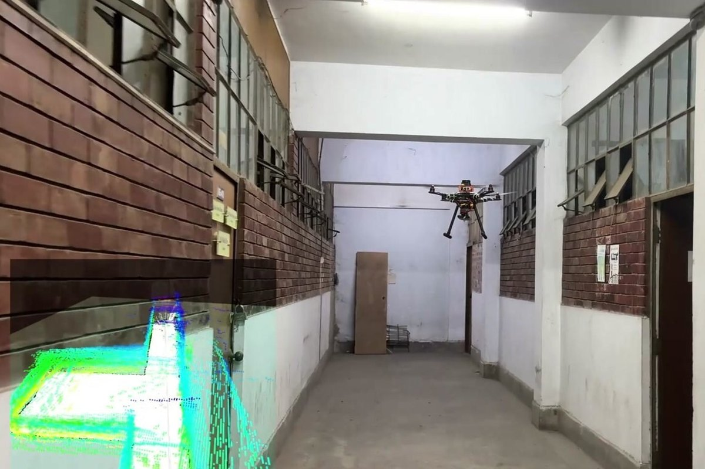
</p>
<p align="center"><em>Left: the assembled vehicle with the RPLIDAR C1, orange 3D-printed mounts and carbon-fiber landing gear. Right: corridor flight with the live 3D reconstruction overlaid.</em></p>

<p align="center">
  
  
  
  
  
</p>

VENTRA is an S500-class quadrotor that flies **without GPS** in tunnels, mine shafts, wells, warehouses and other enclosed spaces. A **Pixhawk 6C running PX4** handles inner-loop control and EKF2 state estimation, while a **Raspberry Pi 5 running ROS 2 Jazzy** carries a 360° 2D LiDAR and a low-light camera and does mapping, localization, planning and the operator interfaces. The two are joined by PX4's **uXRCE-DDS** bridge.

Optical flow on its own let EKF2's position reset over dim or plain floors. To fix that, VENTRA uses a **LiDAR-anchored localization chain**: RF2O scan-matching odometry plus SLAM Toolbox produce a map-frame pose, and that pose goes back into EKF2 as an **external-vision** measurement. On top of this sit Nav2 (A*), a custom frontier explorer, a braking-limited reactive-avoidance filter and stacked-section 3D mapping. A separate **SLAM-free shaft-inspection mode** handles vertical bores.

*ME 366 (Electro-Mechanical System Design and Practice) final project, Group B9, Department of Mechanical Engineering, BUET, October 2026.*

---

## Highlights

| | |
|---|---|
| **GPS-free hover** | 283 s logged indoor flight held **1.15 m altitude, σ = 0.07 m**, roll/pitch within ±5° |
| **LiDAR-anchored pose** | RF2O + SLAM Toolbox pose sent to EKF2 as external vision at 10 Hz, so the estimate no longer resets over featureless floors |
| **Live 2D + 3D mapping** | 5 cm occupancy grid in real time; every scan placed at PX4's measured height and attitude in a 10 cm voxel map |
| **Autonomous exploration** | Nav2 (A*) follows goals picked by a custom frontier explorer for ROS 2 Jazzy |
| **Reactive avoidance** | Caps every velocity command at a speed the vehicle can still stop from, so it slides along walls instead of stopping dead |
| **Shaft inspection** | Bore centre measured in every scan and fused as an absolute fix. In PX4 SITL it flew a **fully autonomous 24.8 m descent and return with no wall contact** |
| **Ground-control tools** | Browser launcher (start/stop/monitor every node), web teleop dashboard with live MJPEG video, read-only shaft dashboard |

---

## System Architecture

VENTRA splits fast, safety-critical control from heavy autonomy. The Pixhawk 6C runs PX4 estimation and control and keeps the vehicle stable even if the companion computer stalls. The Raspberry Pi 5 runs perception, SLAM, pose fusion and autonomy in ROS 2. The uXRCE-DDS link (orange) carries PX4 odometry out, and external-vision poses and offboard setpoints in, over `/dev/ttyAMA0` ↔ TELEM2 at 921 600 baud.

<p align="center">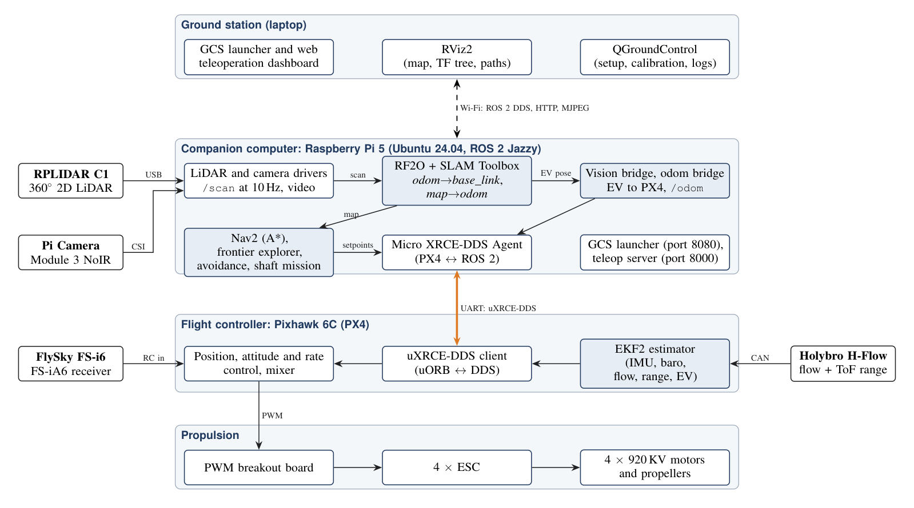</p>

### Localization and autonomy pipeline

RF2O and SLAM Toolbox anchor the pose to the map, and the vision bridge sends it back to EKF2 as external vision (thick orange arrow). The map drives Nav2 and the frontier explorer. Every velocity command passes through the reactive-avoidance filter before the offboard bridge sends it to PX4.

<p align="center">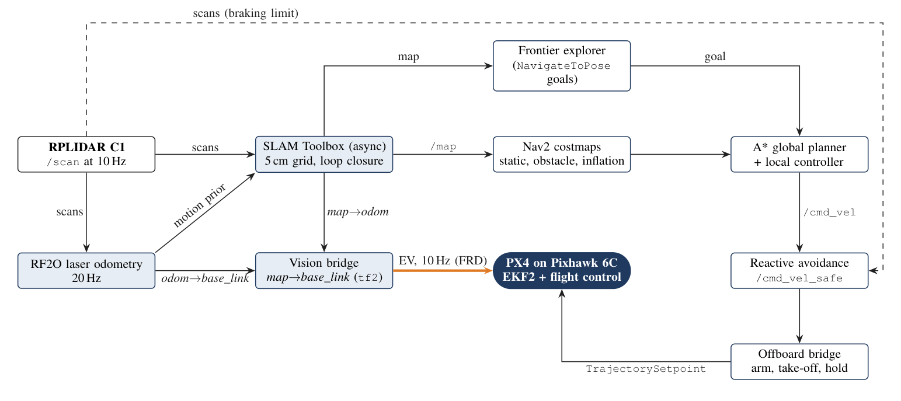</p>

### TF tree (REP 105)

<p align="center">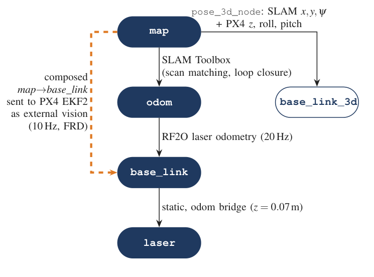</p>

Every TF edge has exactly one owner, because two publishers on the same edge corrupt the tree:

| Edge | Owner |
|---|---|
| `map → odom` | SLAM Toolbox |
| `odom → base_link` | RF2O (its odometry is published on `/odom_rf2o`) |
| `base_link → laser` | `odom_bridge_node` (static, z = 0.07 m) |
| `map → base_link_3d` | `pose_3d_node`: SLAM x, y, yaw plus PX4 z, roll, pitch, used for 3D mapping |

PX4 uses NED/FRD and ROS uses ENU/FLU. The bridges convert in both directions. The SLAM map has no north reference, so the external-vision pose is declared in PX4's heading-locked FRD frame.

---

## Operating Modes

<p align="center">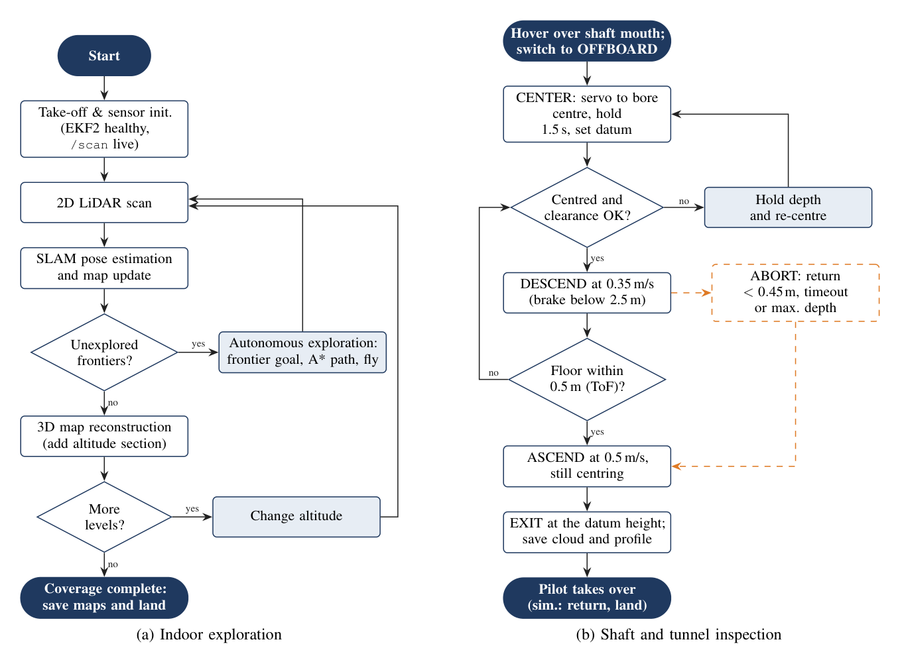</p>
<p align="center"><em>Mission logic: (a) indoor exploration with Nav2 and the frontier explorer, (b) the shaft-inspection state machine. The dashed path is the abort branch.</em></p>

### 1. Indoor exploration
1. Take off and wait for sensors to initialize (EKF2 healthy, `/scan` live).
2. SLAM Toolbox builds a 2D occupancy map from the LiDAR scans.
3. The frontier explorer picks the boundary between known free space and unknown space; Nav2 plans an A* path to it and the vehicle flies there while avoiding obstacles.
4. When no reachable frontiers remain, the map is done at that altitude. Repeating at other altitudes adds horizontal sections to the 3D reconstruction.

<table>
  <tr>
    <td width="50%">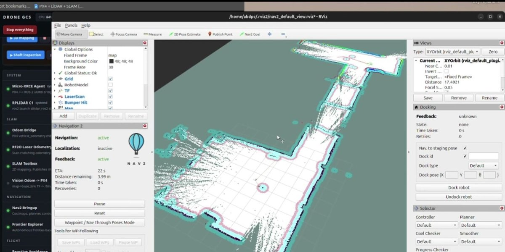</td>
    <td width="50%">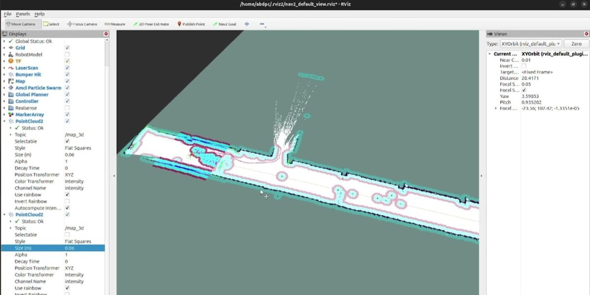</td>
  </tr>
  <tr>
    <td align="center"><em>GCS launcher beside RViz2 with the Nav2 panel and a planned path</em></td>
    <td align="center"><em>Frontier exploration of a corridor map</em></td>
  </tr>
  <tr>
    <td>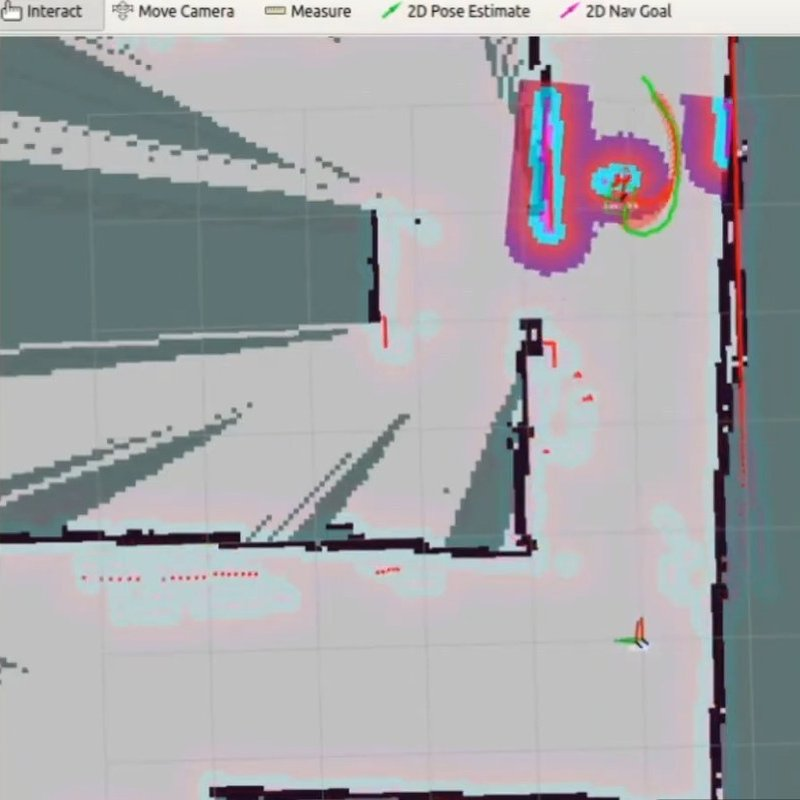</td>
    <td>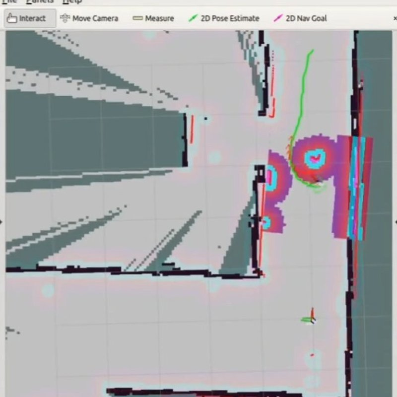</td>
  </tr>
  <tr>
    <td align="center"><em>A new obstacle appears near the planned path…</em></td>
    <td align="center"><em>…and Nav2 re-plans around it</em></td>
  </tr>
  <tr>
    <td>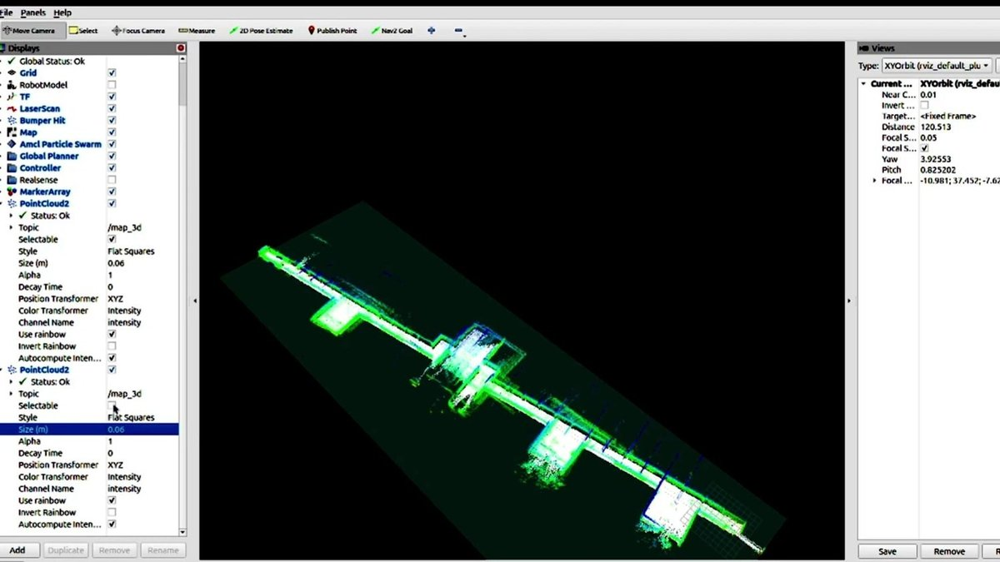</td>
    <td>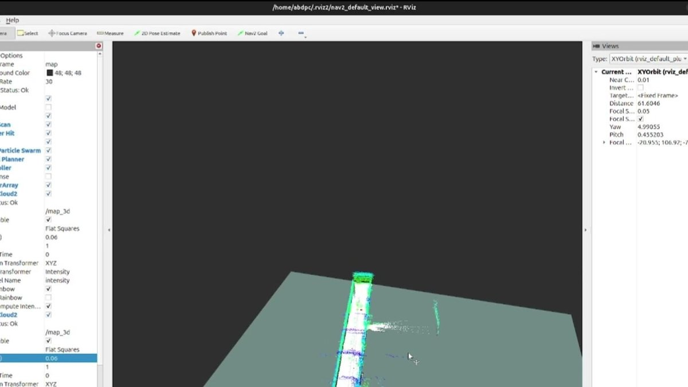</td>
  </tr>
  <tr>
    <td align="center"><em>Stacked LiDAR sections forming a 3D point cloud of a corridor</em></td>
    <td align="center"><em>The 3D model in RViz2</em></td>
  </tr>
</table>

### 2. Shaft and tunnel inspection (`shaft_inspection`)
A vertical bore gives scan-matching SLAM almost nothing to work with along its axis, so this mode uses no SLAM:

| Quantity | Source |
|---|---|
| Horizontal position | Bore centre (point of maximum clearance, via Euclidean distance transform) from every scan, sent to EKF2 as external vision |
| Depth | EKF2 height with the barometer as reference |
| Distance to floor | Downward ToF rangefinder |
| Wall avoidance | Centring, repulsion and a velocity clamp, all from the LiDAR |
| 3D map | Scans stacked at known depth, one slice per 5 cm |

Mission sequence: hover over the shaft mouth → **OFFBOARD** → centre and set the depth datum → descend at 0.35 m/s while centred → brake from 2.5 m and turn around 0.5 m above the floor → climb at 0.5 m/s → stop at the datum height and hand back to the pilot. Outputs are a point cloud (`.pcd`) and a radius-vs-depth profile (`.csv`).

<p align="center">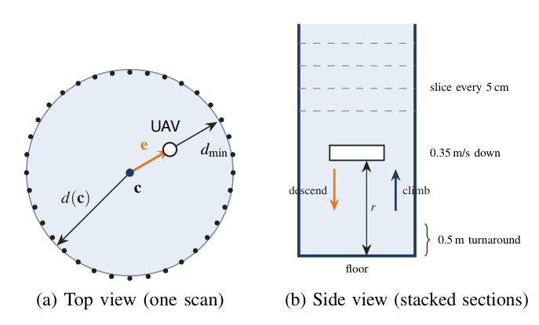</p>
<p align="center"><em>(a) From each scan's wall points, the vehicle finds the point of maximum clearance <b>c</b> (the bore centre). The offset <b>e</b> drives the centring. (b) The vehicle descends while centred, records a section every 5 cm and turns around 0.5 m above the floor.</em></p>

<table>
  <tr>
    <td width="50%">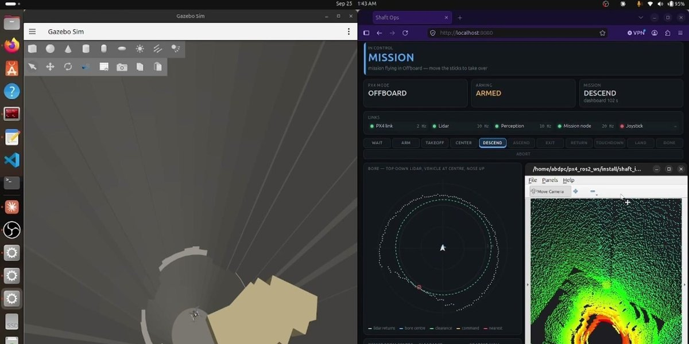</td>
    <td width="50%">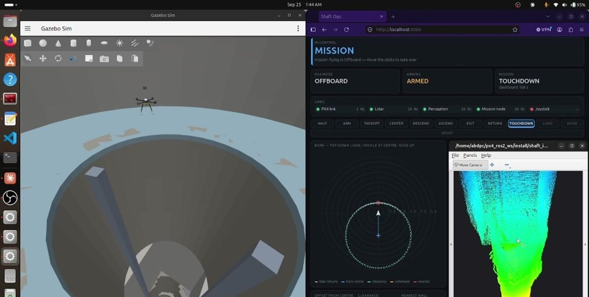</td>
  </tr>
  <tr>
    <td align="center"><em>Simulated descent with the dashboard and the growing 3D map</em></td>
    <td align="center"><em>Completed 3D reconstruction and shaft profile</em></td>
  </tr>
</table>

See [`src/shaft_inspection/README.md`](src/shaft_inspection/README.md) and [`src/shaft_inspection/docs/HARDWARE_GUIDE.md`](src/shaft_inspection/docs/HARDWARE_GUIDE.md) for full details.

---

## Hardware

| Component | Specification | Role |
|---|---|---|
| S500-class X frame | Carbon-fiber landing legs, propeller guards | Structure, protection in confined spaces |
| 4× DJI 920 KV motors + ESCs | 4S Li-Po (14.8 V nominal), ~20–22 A hover | Propulsion |
| Pixhawk 6C | STM32H743, dual IMU, MS5611 baro; PX4 | Control, EKF2 estimation, logging |
| Holybro H-Flow | PAA3905 optical flow + AFBR-S50 ToF, DroneCAN | GPS-free velocity, floor distance |
| RPLIDAR C1 | 360° DTOF, 0.05–12 m, 10 Hz, 0.72° resolution | SLAM, obstacles, 3D reconstruction |
| Raspberry Pi 5 (8 GB) | Ubuntu 24.04, ROS 2 Jazzy | Companion computer |
| Pi Camera Module 3 NoIR | 12 MP IMX708, no IR-cut filter | Low-light operator video |
| FlySky FS-i6 + FS-iA6 | 2.4 GHz, 6 ch | Manual flight and safety override |
| 3DR telemetry radios | MAVLink | Link to QGroundControl |
| USB power bank | 5 V | Separate compute supply (Pi, LiDAR, camera) |
| Custom 3D-printed mounts | PLA, 20–30 % infill, fillets, gussets, rubber standoffs | Hold LiDAR / Pi / camera, keep CoG central |

Total recorded procurement cost: about **139,590 BDT**.

<table>
  <tr>
    <td width="33%">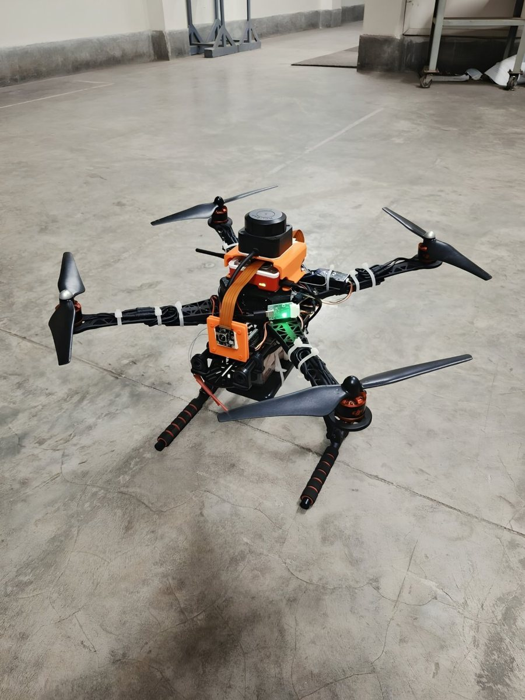</td>
    <td width="33%">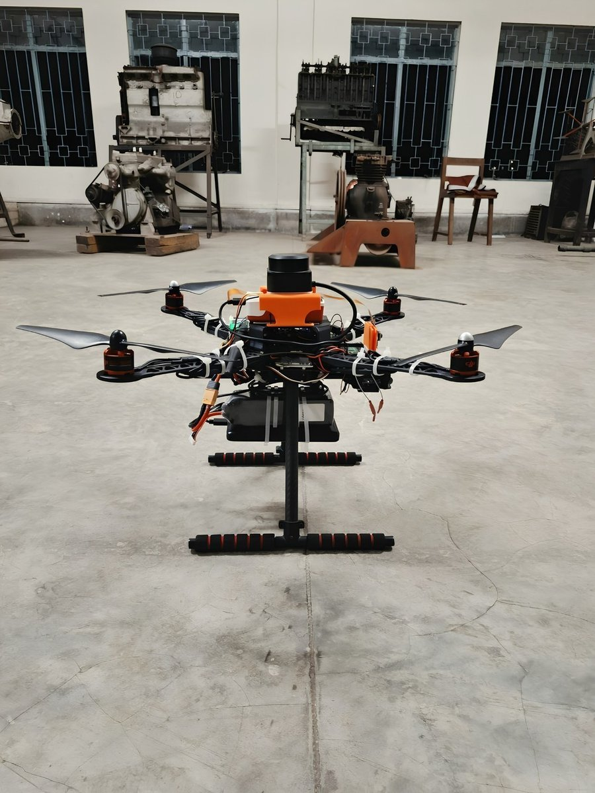</td>
    <td width="33%">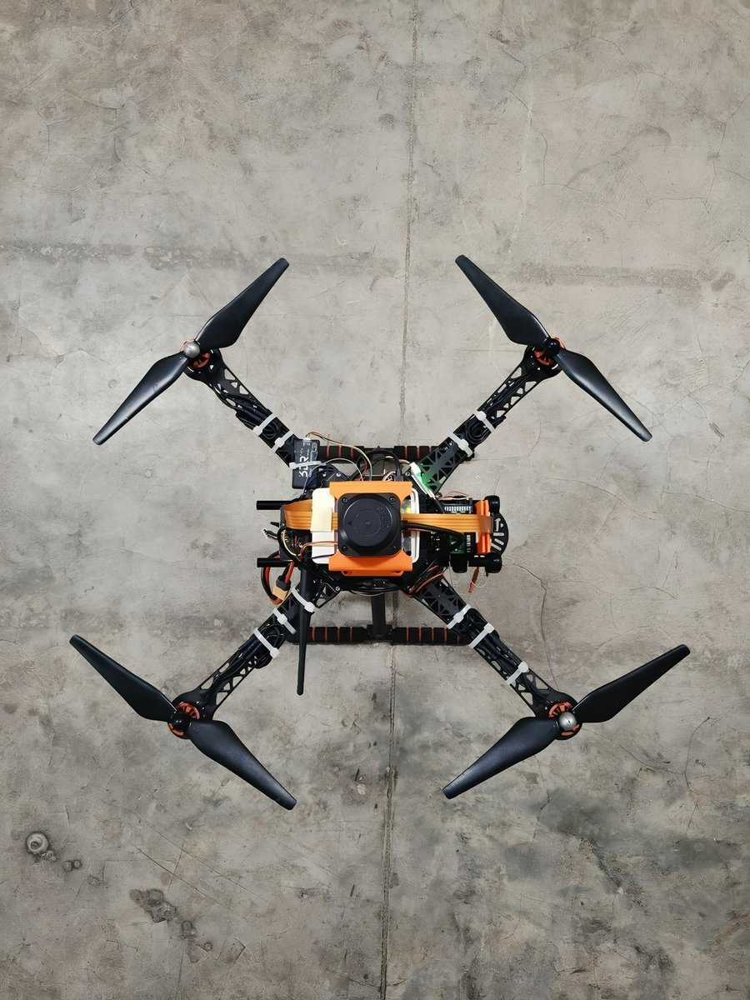</td>
  </tr>
  <tr>
    <td align="center"><em>Three-quarter view</em></td>
    <td align="center"><em>Front view</em></td>
    <td align="center"><em>Top view: X layout and central mount stack</em></td>
  </tr>
  <tr>
    <td>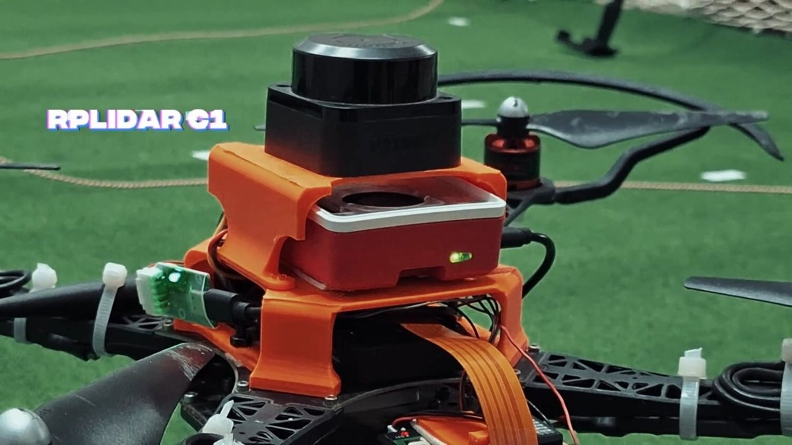</td>
    <td>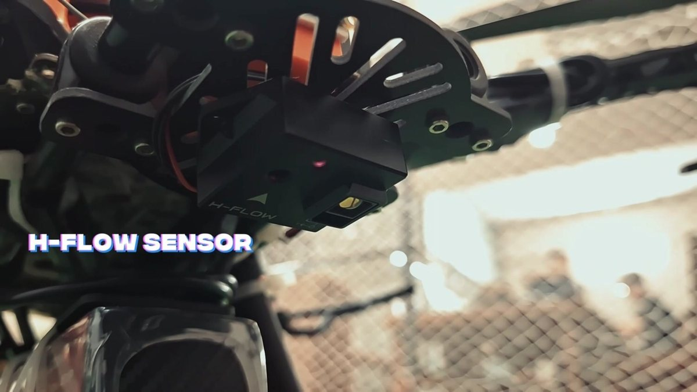</td>
    <td>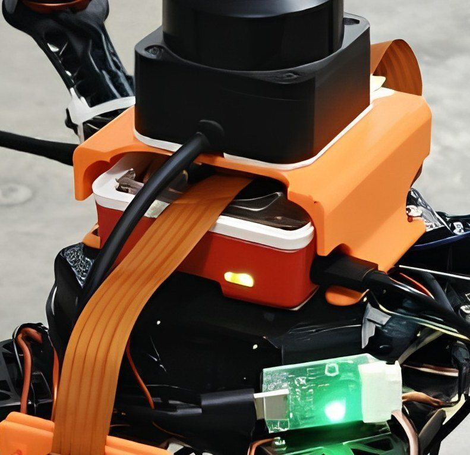</td>
  </tr>
  <tr>
    <td align="center"><em>RPLIDAR C1 on its raised mount</em></td>
    <td align="center"><em>Holybro H-Flow under the body</em></td>
    <td align="center"><em>Redesigned PLA mount above the Pi 5</em></td>
  </tr>
  <tr>
    <td>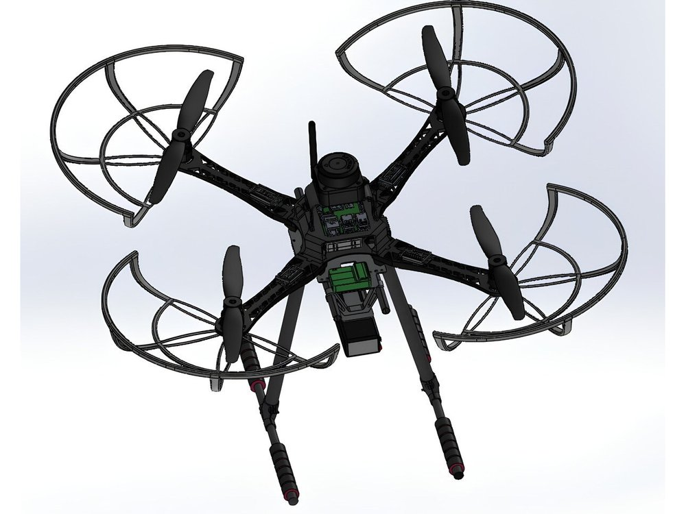</td>
    <td>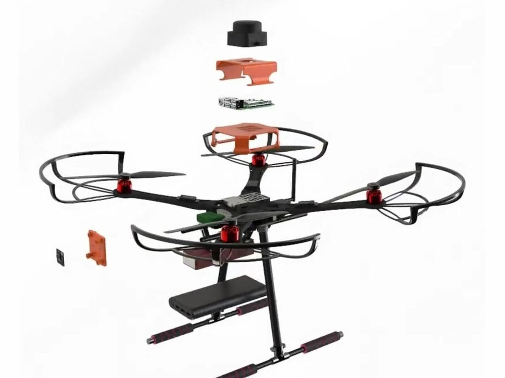</td>
    <td>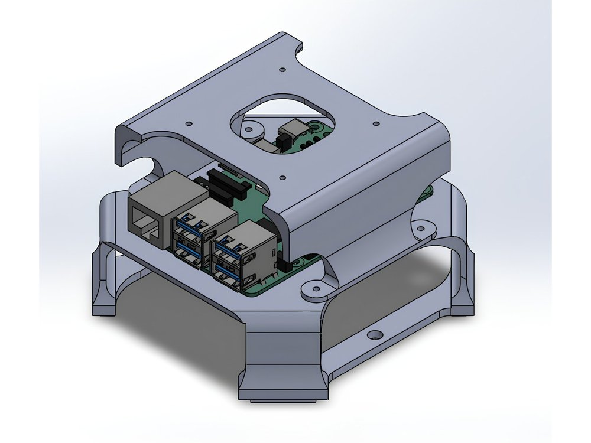</td>
  </tr>
  <tr>
    <td align="center"><em>CAD model with propeller guards</em></td>
    <td align="center"><em>Exploded view of the stack</em></td>
    <td align="center"><em>Ventilated housing with the Pi 5 in place</em></td>
  </tr>
</table>

### Power distribution and wiring

The flight domain (left) and the compute domain (right) have separate power supplies. They are joined only by the TELEM2–UART link (TX, RX and ground only; the Pixhawk's 5 V is never connected to the Pi).

<p align="center">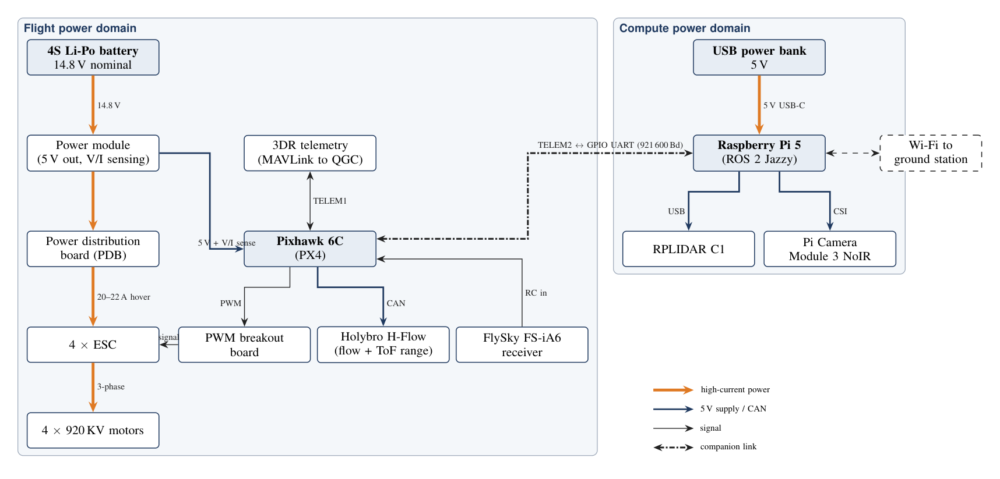</p>

---

## Repository Layout

```
.
├── drone_gcs.py                 # Browser-based Ground Control launcher (port 8080)
├── web_teleop.py                # Web teleop dashboard: MJPEG video, joystick/D-pad/keys (port 8000)
├── TECHNICAL_HANDBOOK.md        # Workspace technical handbook
├── docs/images/                 # Photos, diagrams and plots used in this README
├── run_cmds/
│   ├── slam.sh                  # Brings up the LiDAR-anchored localization chain in order
│   └── drone3d.rviz             # RViz2 config for 2D/3D mapping
├── scripts/
│   ├── visualize.py             # PX4 odometry → ROS bridge for Gazebo SITL
│   └── real_visualize.py        # Same, for real hardware (system clock, no sim time)
├── obstacle_avoidance/          # Standalone MAVSDK + RPLIDAR front-obstacle back-off demo
├── slam_params.yaml             # SLAM Toolbox parameters
├── shaft_real.yaml              # shaft_inspection parameters for the REAL vehicle
├── px4_offboard_updated.zip     # Updated cmd_vel → offboard controller and keyboard teleop
└── src/                         # colcon workspace
    ├── odom_bridge/             # Localization, exploration, avoidance, 3D mapping (team)
    │   ├── odom_bridge/
    │   │   ├── odom_bridge_node.py      # PX4 NED/FRD → /odom ENU/FLU + static laser TF
    │   │   ├── vision_odom_bridge.py    # map→base_link → /fmu/in/vehicle_visual_odometry
    │   │   ├── pose_3d_node.py          # base_link_3d frame (SLAM x,y,ψ + PX4 z,φ,θ)
    │   │   ├── scan_3d_mapper.py        # 10 cm voxel map on /map_3d, save as .ply
    │   │   ├── frontier_explorer.py     # Frontier detection → Nav2 NavigateToPose goals
    │   │   └── reactive_avoidance.py    # Braking-limited, wall-sliding velocity filter
    │   ├── launch/full_stack_launch.py  # Staggered bridge → RF2O → SLAM → vision bridge
    │   └── config/slam_toolbox_params.yaml
    ├── shaft_inspection/        # SLAM-free shaft mission, perception, mapper, dashboard (team)
    ├── ROS2-PX4_Drone_Teleoperation_Using_Joystick/  # PX4 SITL + keyboard/joystick offboard
    ├── rf2o_laser_odometry/     # RF2O scan-matching odometry (third-party, built from source)
    ├── px4_msgs/                # PX4 message definitions (third-party)
    └── px4_ros_com/             # PX4 ↔ ROS 2 helpers (third-party)
```

---

## Getting Started

### Prerequisites
- Raspberry Pi 5 with **Ubuntu 24.04** and **ROS 2 Jazzy**
- Pixhawk 6C flashed with **PX4** and calibrated in QGroundControl
- [Micro XRCE-DDS Agent](https://docs.px4.io/main/en/middleware/uxrce_dds.html)
- [`sllidar_ros2`](https://github.com/Slamtec/sllidar_ros2) for the RPLIDAR C1

### Build

```bash
sudo apt install ros-jazzy-slam-toolbox ros-jazzy-navigation2 ros-jazzy-nav2-bringup
git clone https://github.com/abulhasnat-abdullah/Indoor_drone_project.git ~/px4_ros2_ws
cd ~/px4_ros2_ws && colcon build
source install/setup.bash
```

### Bring-up

```bash
# PX4 bridge and LiDAR driver (normally run as systemd services)
MicroXRCEAgent serial --dev /dev/ttyAMA0 -b 921600
ros2 launch sllidar_ros2 sllidar_c1_launch.py

# LiDAR-anchored localization (edit the params path inside slam.sh for your home folder)
bash ~/px4_ros2_ws/run_cmds/slam.sh
#   or: ros2 launch odom_bridge full_stack_launch.py

# Everything else from a browser at http://<pi-ip>:8080
python3 ~/px4_ros2_ws/drone_gcs.py
```

The Nav2 parameter file the launcher loads (`~/nav2_params.yaml`) is kept outside this repository.

### Simulation
- **Teleoperation / offboard development:** see [`src/ROS2-PX4_Drone_Teleoperation_Using_Joystick`](src/ROS2-PX4_Drone_Teleoperation_Using_Joystick/README.md) (PX4 SITL + Gazebo + XRCE-DDS agent).
- **Shaft mission:** PX4 SITL with the `x500_shaft` model (airframe 4023) in the `vshaft` world. See [`src/shaft_inspection/run_cmds/shaft_sim.sh`](src/shaft_inspection/run_cmds/shaft_sim.sh).

---

## Key PX4 Parameters for GPS-Denied Flight

| Parameter | Value | Purpose |
|---|---|---|
| `EKF2_GPS_CTRL`, `SYS_HAS_GPS` | 0, 0 | No GPS aiding or checks |
| `COM_ARM_WO_GPS` | 1 | Allow arming without GPS |
| `UAVCAN_ENABLE` | 2 | DroneCAN sensors (H-Flow) |
| `EKF2_OF_CTRL` | 1 | Fuse optical flow |
| `EKF2_HGT_REF`, `EKF2_BARO_CTRL` | 0, 1 | Barometer is the height reference |
| `EKF2_RNG_CTRL` | 1 | Rangefinder aids height only when low (< 3 m) and slow (< 1 m/s) |
| `EKF2_EV_CTRL` | HPOS + yaw indoors; HPOS only (1) in shafts | External-vision fusion |
| `EKF2_EV_DELAY` | ~50 ms (tune from logs) | Scan + processing latency |
| `MPC_XY_VEL_MAX` | 1.0 m/s | Confined-space speed limit |
| `MPC_TILTMAX_AIR` | 20° | Limits tilt, and so scan-plane tilt |
| `COM_RC_OVERRIDE` | 3 | Sticks take over in Auto and Offboard |

The full parameter set is in [`src/shaft_inspection/deploy/px4_v1.14_shaft.params`](src/shaft_inspection/deploy/px4_v1.14_shaft.params), with explanations in [`px4_v1.14_shaft_params_explained.txt`](src/shaft_inspection/deploy/px4_v1.14_shaft_params_explained.txt). The external-vision setup is in [`src/odom_bridge/README.md`](src/odom_bridge/README.md).

---

## Results

| Quantity | Value |
|---|---|
| Logged flight duration | 283 s, indoor, no GPS |
| Hold altitude | mean 1.15 m, σ = 0.07 m |
| Roll / pitch in steady hover | within ±5° |
| Hover current / power | 20–22 A, ≈ 270–300 W |
| Battery internal resistance | ≈ 0.11 Ω |
| Dominant vibration | 105–111 Hz rotor band, no growth over the flight |
| Shaft mission (SITL) | 24.8 m autonomous descent + return, no wall contact |
| Bore-centre estimator | 1–5 cm agreement on circular, rectangular, elliptical, D-shaped and rough sections, ~3 ms per scan |

### Flight-log analysis (283 s GPS-free flight)

<table>
  <tr>
    <td width="50%">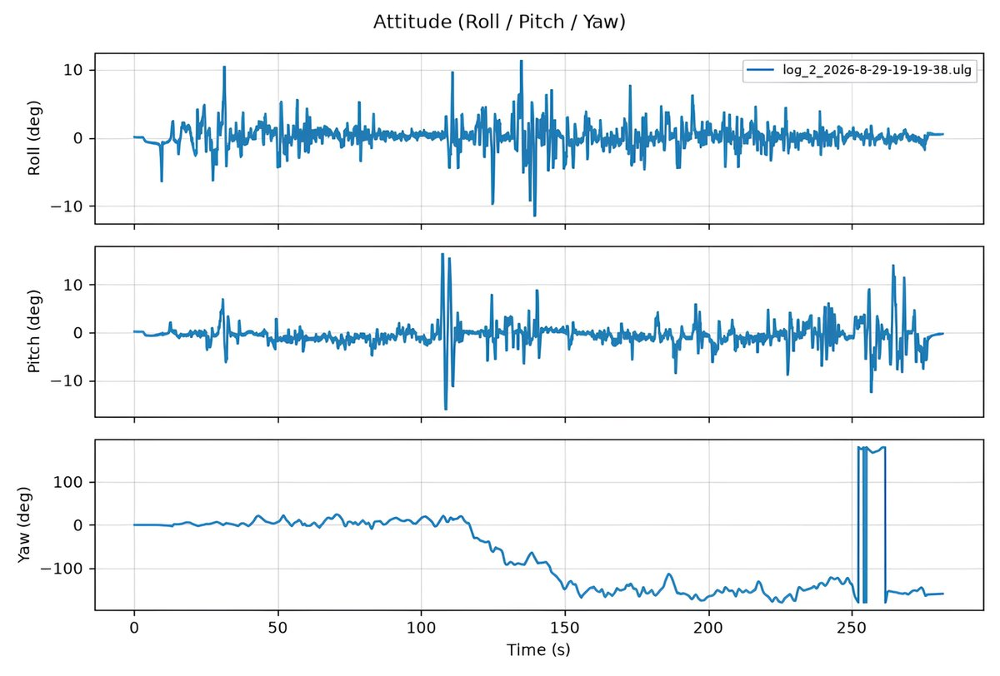</td>
    <td width="50%">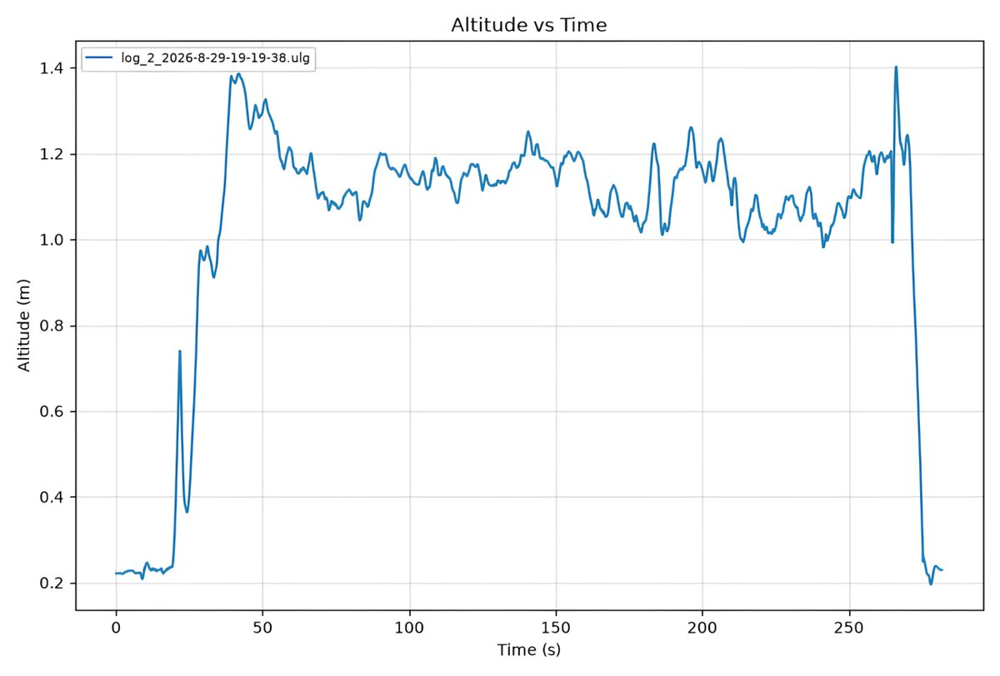</td>
  </tr>
  <tr>
    <td align="center"><em>Roll, pitch and yaw</em></td>
    <td align="center"><em>Altitude: 1.15 m hold, σ = 0.07 m</em></td>
  </tr>
  <tr>
    <td>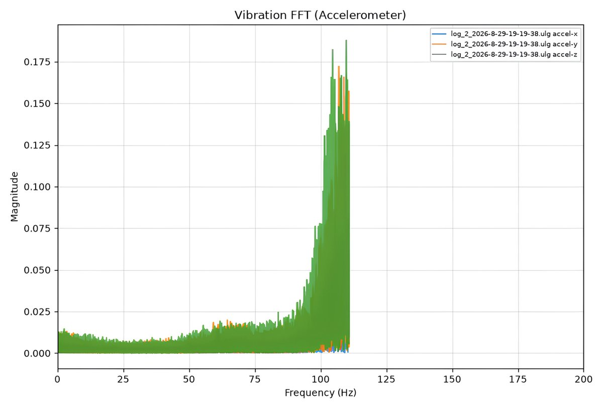</td>
    <td>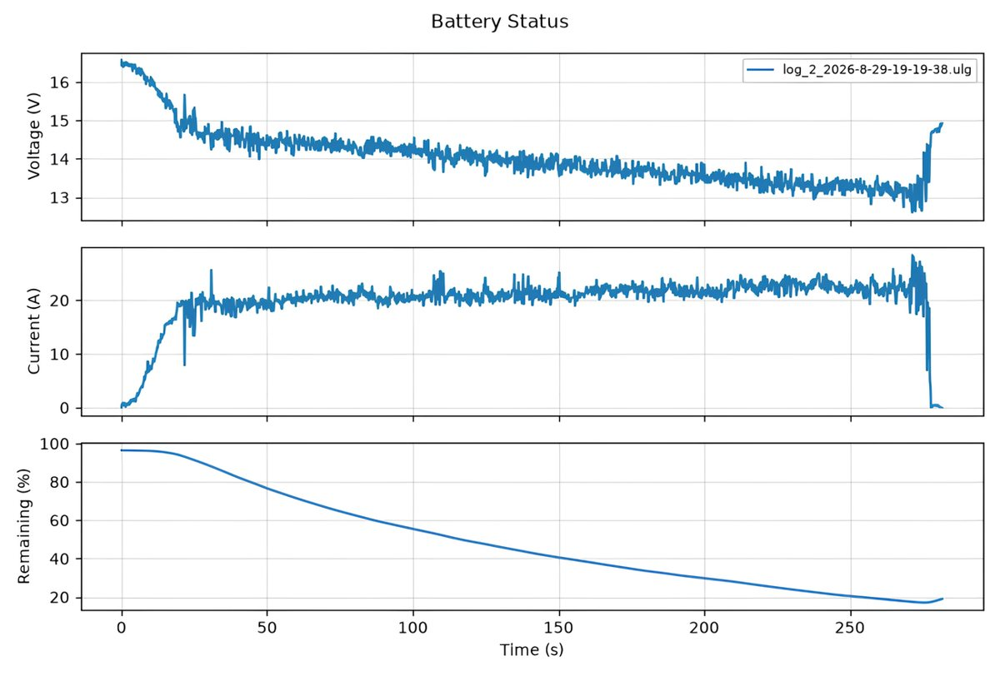</td>
  </tr>
  <tr>
    <td align="center"><em>Accelerometer FFT: energy confined to the 105–111 Hz rotor band</em></td>
    <td align="center"><em>Battery voltage, current and remaining charge</em></td>
  </tr>
</table>

### Mapping

<table>
  <tr>
    <td width="50%">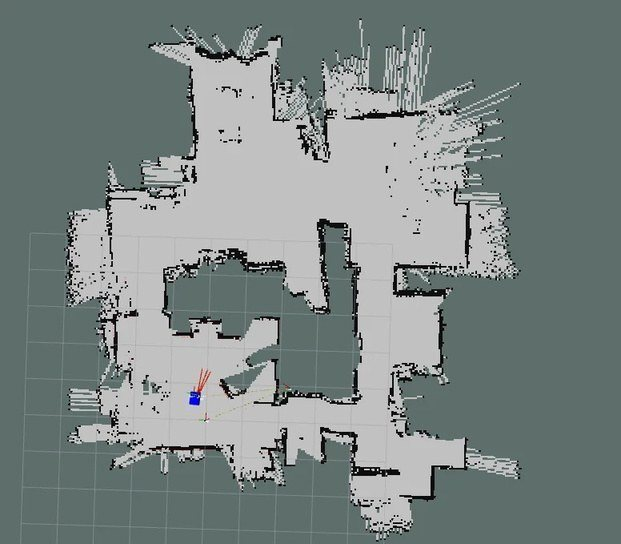</td>
    <td width="50%">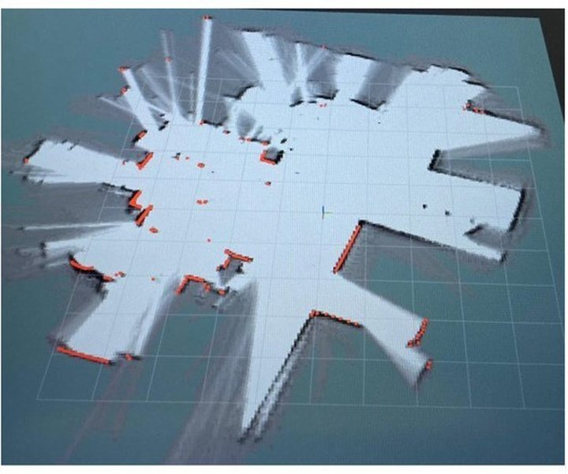</td>
  </tr>
  <tr>
    <td align="center"><em>Occupancy map of a multi-room area</em></td>
    <td align="center"><em>Perspective view of a mapped area</em></td>
  </tr>
</table>

### Ground-control software

<table>
  <tr>
    <td width="33%">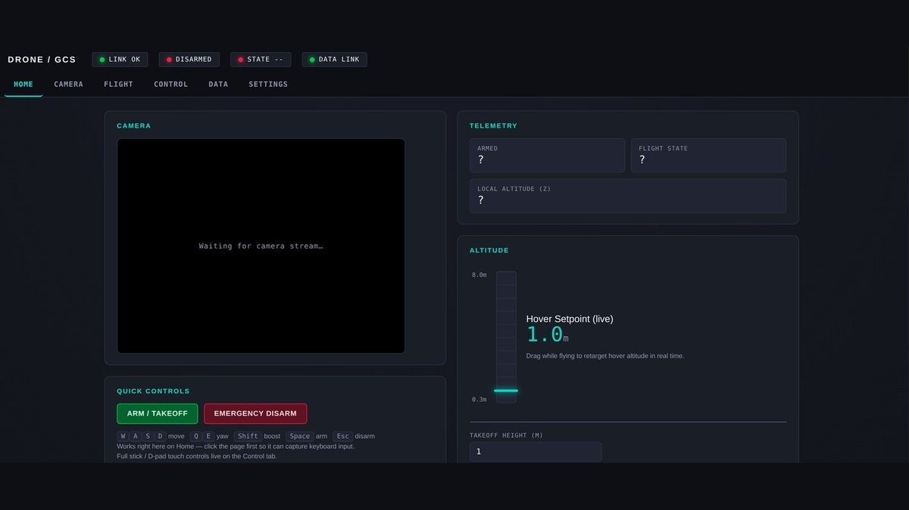</td>
    <td width="33%">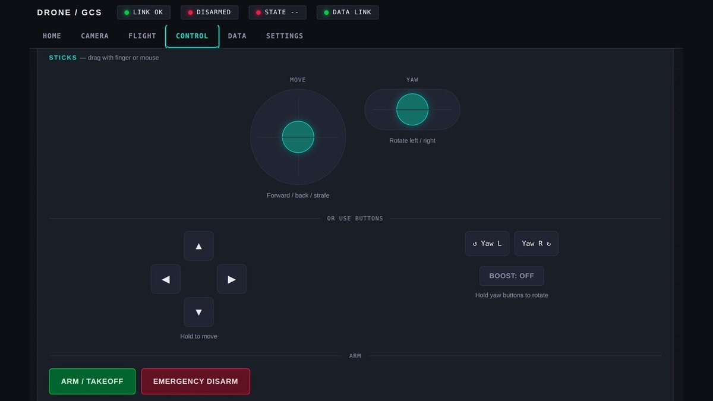</td>
    <td width="33%">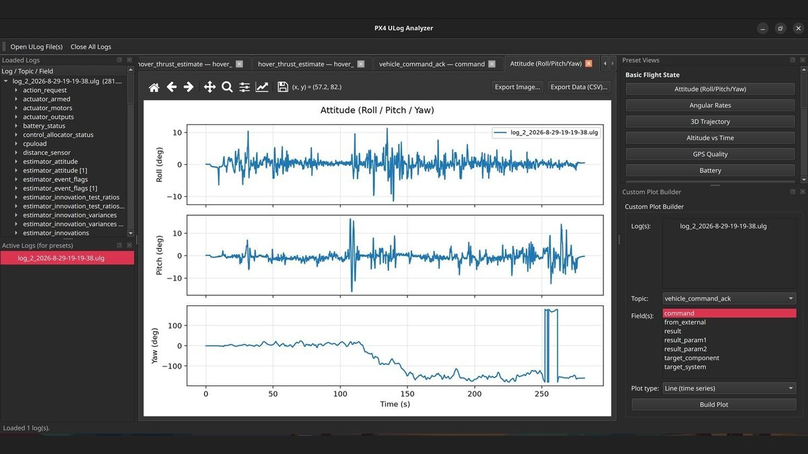</td>
  </tr>
  <tr>
    <td align="center"><em>Web teleop: video, arming and emergency controls</em></td>
    <td align="center"><em>Virtual joystick and D-pad</em></td>
    <td align="center"><em>PX4 flight-log workbench</em></td>
  </tr>
</table>

---

## Scope and Limitations

- Indoor exploration, mapping and 3D reconstruction were demonstrated **on the real vehicle**. The shaft mission has been validated **in PX4 SITL only**.
- The RPLIDAR C1 is a **2D** sensor. Obstacles above or below the scan plane, glass and mirror-like surfaces may be missed.
- Map and pose accuracy were **not measured against ground truth** (e.g. motion capture).
- Endurance is about 5 minutes. A dedicated regulator would let the power bank go.
- All flights used a safety pilot with an RC transmitter. Test without propellers first.

---

## Team

**Group B9, Department of Mechanical Engineering, BUET**

- Abul Hasnat Abdullah (2210061)
- Azwad Wakif Rajin (2210089)
- Ahnaf Chowdhury (2210093)

**Supervisors:** Dr. Kazi Arafat Rahman · Md. Moyeenul Hossain Ratul · Rafiul Haq · Kazi Tawseef Rahman

## Acknowledgements

Built on [PX4 Autopilot](https://px4.io), [ROS 2](https://docs.ros.org/en/jazzy/), [SLAM Toolbox](https://github.com/SteveMacenski/slam_toolbox), [Nav2](https://nav2.org), [RF2O laser odometry](https://github.com/MAPIRlab/rf2o_laser_odometry) and [sllidar_ros2](https://github.com/Slamtec/sllidar_ros2). The third-party packages in `src/` keep their original licenses.
